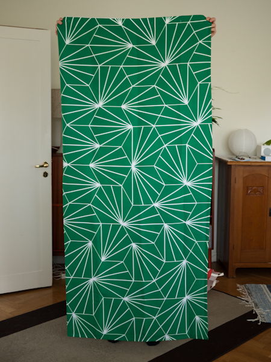

# Dandelion

In 2013 we were renovating our bathroom. When trying to decide what tiles to pick we stumbled upon Dandelion by [Claesson Koivisto Rune](http://www.claessonkoivistorune.se/), a [beautiful hexagonal tile pattern](http://www.urdesign.it/index.php/2013/07/16/aesop-covent-garden-by-cigue/).

We ended up not using the dandelion tiles, but this repo contains the code I used to create a custom shower curtain with the dandelion pattern printed on it using Haskell and the [Diagrams](http://projects.haskell.org/diagrams/) package.

Here's the end result:

A similar idea is to laser cut the pattern as done here: [http://www.notcot.com/archives/2013/04/laser-challenge-2-cardboard-he.php](http://www.notcot.com/archives/2013/04/laser-challenge-2-cardboard-he.php).